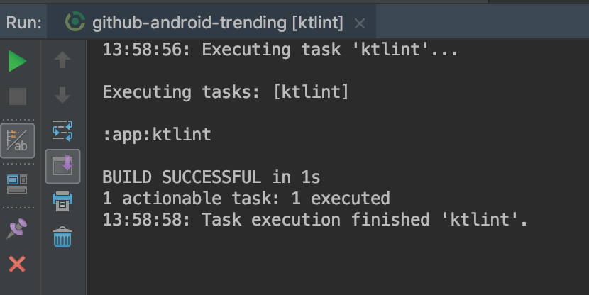

# github-android-trending

Android app that shows the list of trending Android repositories on GitHub, starting from the most popular ones.
Written in Kotlin, and uses many popular libraries, such as RxJava, Retrofit, Glide, Espresso, and others.

  
  

## Functionality
Contains repos list and repo details fragments. The first one shows the list of trending Android repositories and the second is shown when you click on the item from the list. The list can be refreshed with a toolbar action. The details include repo's title, description, owner's image, stars, open issues, watchers, and forks couts, last update date, main language, license, and readme. Also, GitHub button to go directly to the project (in browser) and Share button - to share repo's link.

## Libraries used:
* AppCompat
* CardView
* ConstraintLayout
* RecyclerView
* OkHttp 3
* Retrofit 2
* Reactive Network
* RxJava
* Glide
* MarkdownView
* Mockito
* PowerMock
* JUnit
* Espresso
* KTLint

## Build types
### Debug
Is debuggable and does not minify nor shrinks resources. 
Generated debug apk size: 4.5 MB

### Release
Isn't debuggable, has minify and shrinking enabled, with ProGuard rules applied. 
Signed apk size: 2 MB

## Tests
### KTLint

The project has ktlint integration and has successfully passed the rule's verification.

### Unit tests
The project incluces unit tests, written with JUnit, for dates and string extensions logic: RepoDatesUnitTest and StringExtensionsUnitTest.

### UI tests
The project incluces UI tests, written in Espresso, for testing some of the UI look: RepoListInstrumentedTest and RepoDetailsInstrumentedTest.
